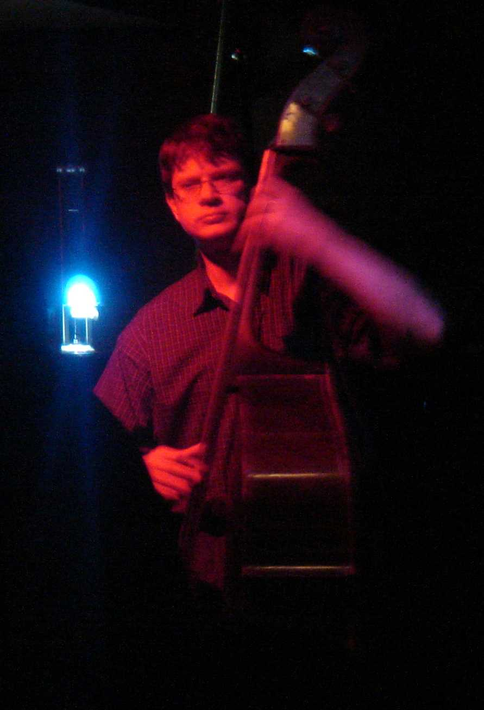

<html>

<head>
<meta http-equiv="Content-Type"
content="text/html; charset=iso-8859-1">
<meta name="CREATED" content="0;0">
<meta name="CHANGED" content="20090525;17010600">
<meta name="Date" content="03/08/14">
</head>

<body bgcolor="#FFFFFF" text="#000000" link="#0000FF"
vlink="#800080" lang="en-US" dir="LTR">

<h1 align="center">Francis Deck, Bassist</h1>

<h3 align="center">String Bass | Electric
Bass</h3>

 

<a href="https://sites.google.com/site/hpftechllc/"><strong>
HPF-Pre</strong></a>

&quot;You played great, as always. You have a
natural ear, plus good knowledge, and your jokes are sometimes
marginal.&quot;

-- Dan Barker 

</body>
</html>

## Music
Thanks for visiting my page. If you are looking for a
versatile upright or electric bassist you have come to the right
place! My experience includes more than a decade of freelance
jazz gigs, symphonic and chamber groups, pit orchestras, ethnic
dance bands, and so forth. I offer a complete range of skills,
including fluent sight-reading, improvisation, knowledge of the
standard jazz repertoire, and simply being easy to deal with.

I moved to Madison in 1997, and have played with numerous
local groups, on a regular or substitute basis.

By day, I am a principal optical systems engineer at the
Madison outpost of Thermo Fisher Scientific Corp., the world
leader in serving science. It's a great place to work, in a
wonderful town. I have a PhD in physics and extensive experience
in development of optical and electronic instrumentation systems.

---

## Electronics and Speakers

<h3>Electronics and Speakers</h3>

Related to music, I have a bit of an electronics hobby. As I
accumulate results, if they are interesting, then I write them up
to share. Often, I find that writing a brief report helps me
critique my own ideas, and also attracts helpful comments that
improve my knowledge. What follows are some of my recent
projects.

### Speaker Theory

What started out as a simple
project to build a bass speaker turned into a quest to understand
the physics of how speakers work. I have written up some of my
notes to share with others who might be interested:
