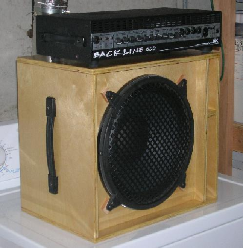
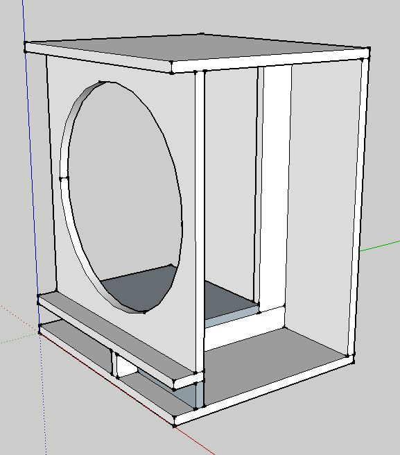
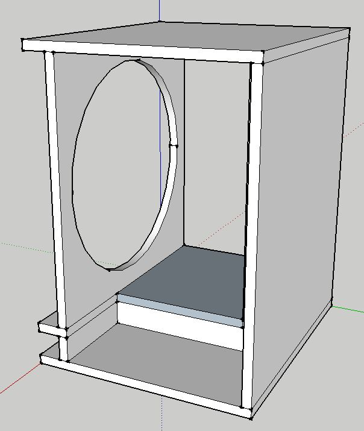
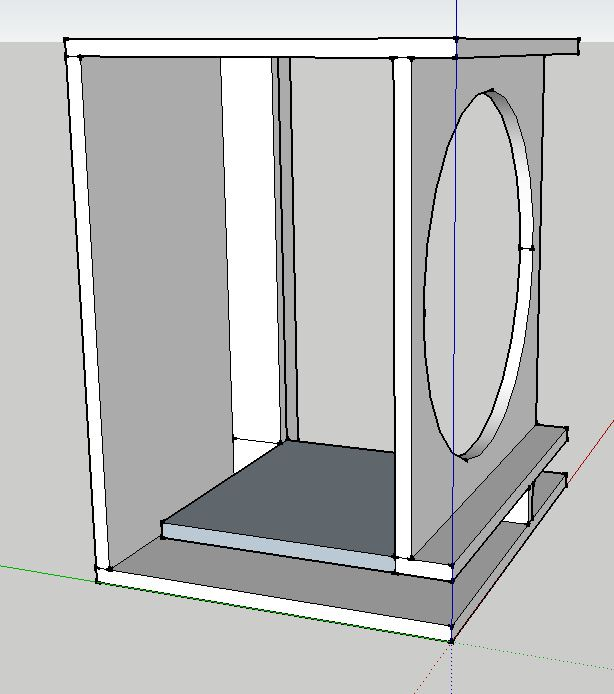
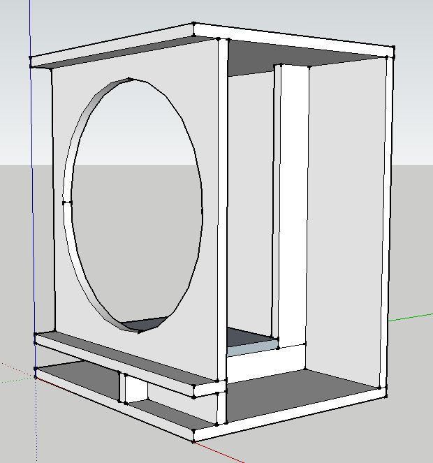
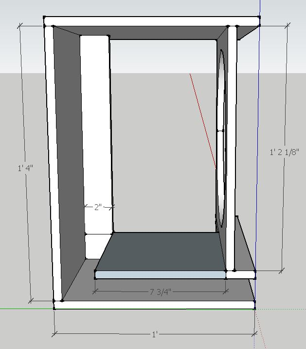
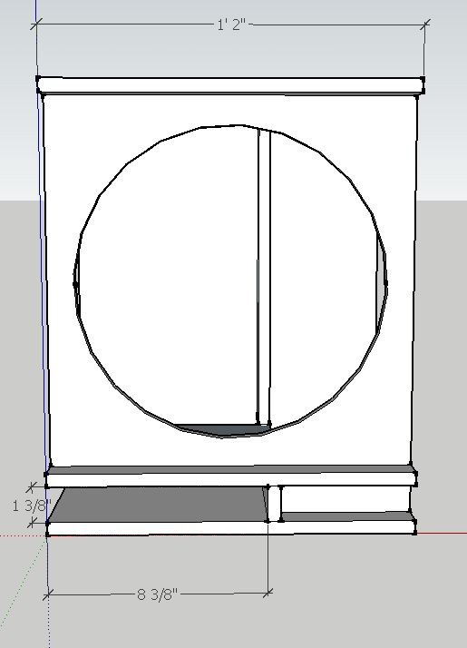
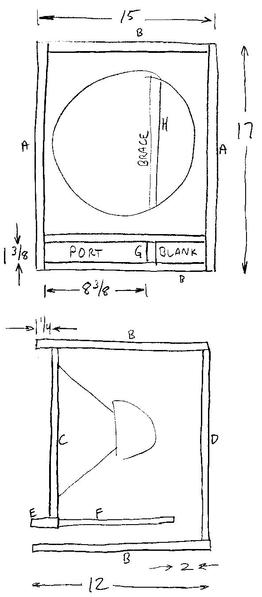
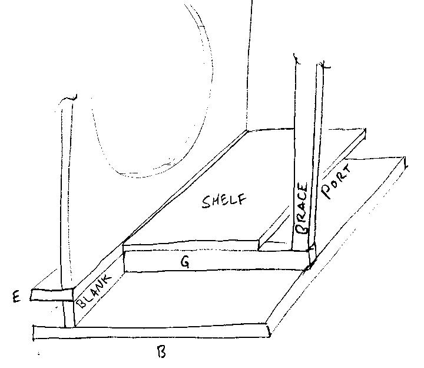

# 12 inch bass speaker

The .pdf file in this repo contains the complete design article

## Drawings

These drawings are pretty minimally dimensioned. I strongly advise drawing them out
yourself on graph paper and make sure you believe the dimensions. Not all of the views
are dimensioned -- they're just to give a more complete picture of how the thing
goes together. Also, I don't cut all of the pieces at once. I start with the innards
and build my way out. Finally I attach the sides. My rationale is that small errors
creep into my cuts, and I can correct them by cutting the following piees bigger
or smaller as needed.

## Earlier drawings

