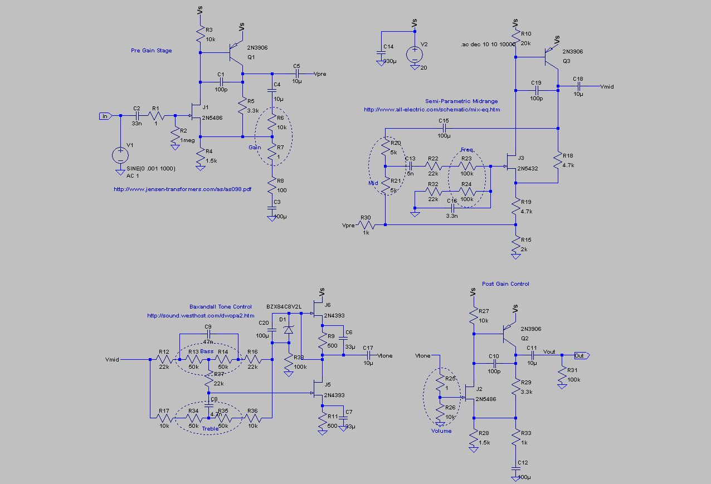
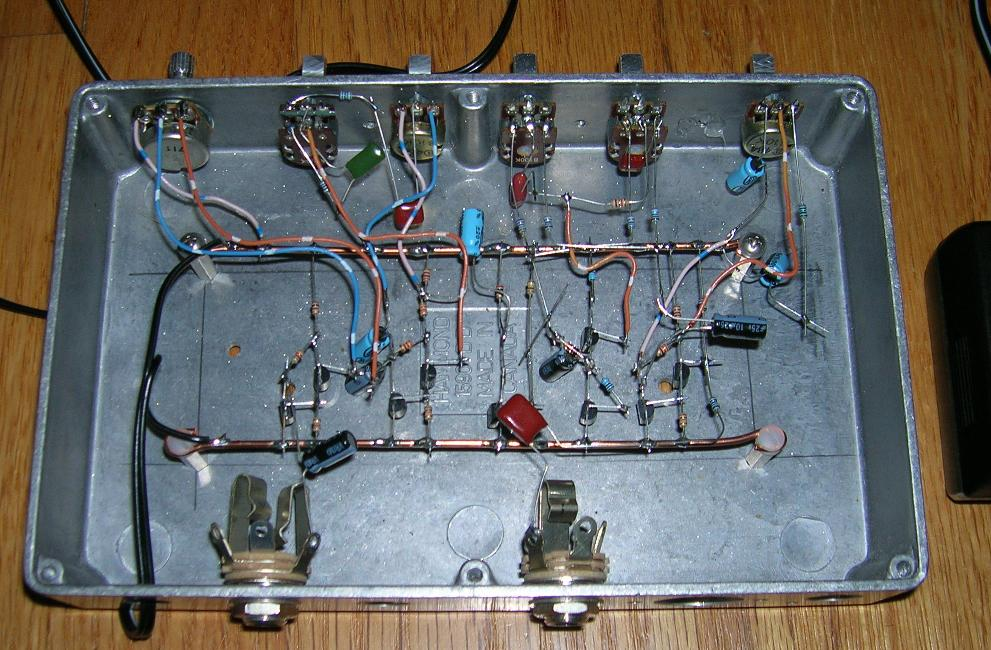

# Discrete JFET bass preamp

This was a flight of fancy, to see if I could use discrete JFETs to achieve functionality similar
to the legendary Ampeg SVT preamp. Naturally I don't expect identical sound, but it was fun
to see what could be done with six transistors.

No documentation, no nuthin'. If folks are interested, I'll add more detail.

