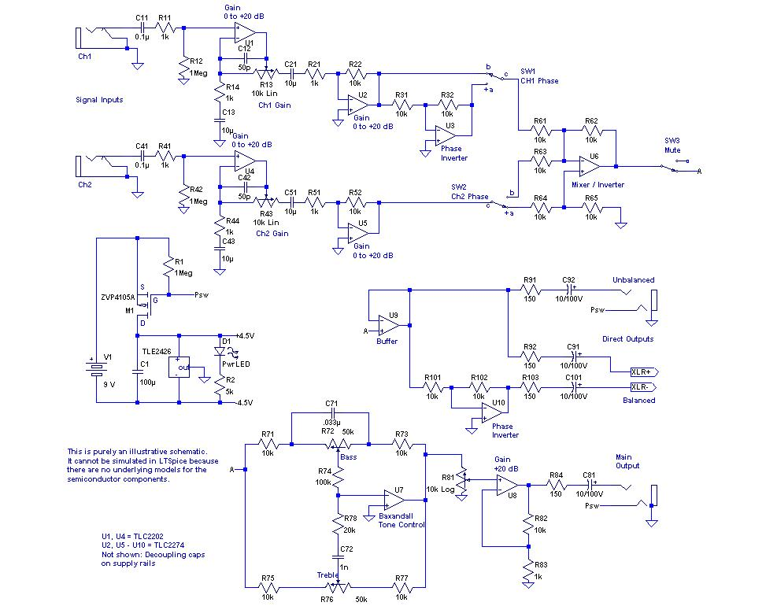
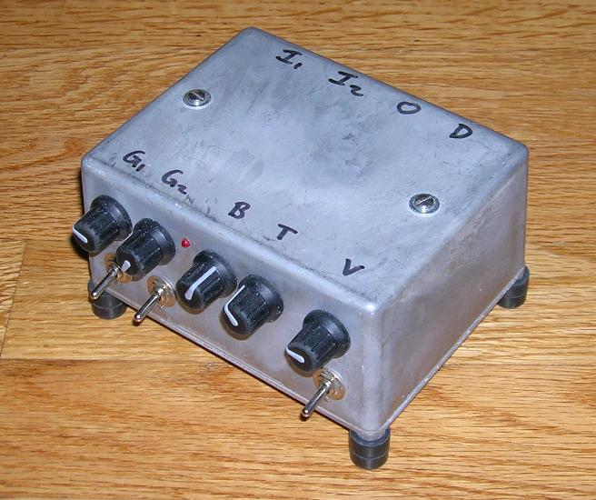
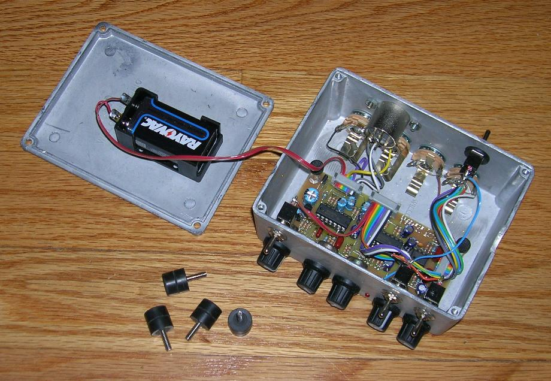
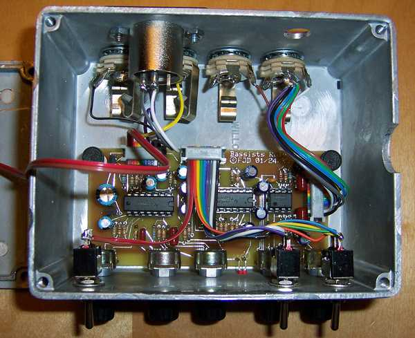

# Bare bones bass blender

This is a circuit that I built for experimenting with bass pickups, and possibly to use in a complete
homemade bass amp. The amp never materialized. Class-D technology came on the scene, and I got one of the
new "micro" heads. But the design is here for anybody who's interested. The .pdf file is the
design document. Here are some pictures:

